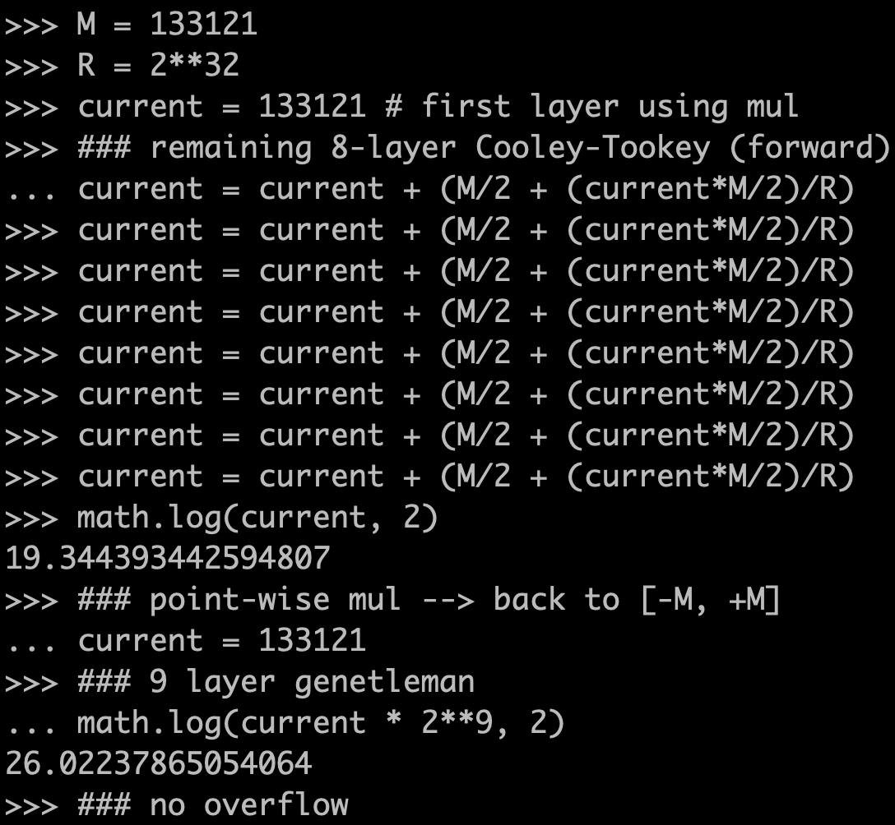

# LAC length 512

## LAC spec

```
// b = as, a --> big, s --> small
poly_mul(const unsigned char *a, const char *s, unsigned char *b)
```

## Assembly usage

```
python3 generate_code.py
make
st-flash write test.bin 0x8000000
```


## Overflow analysis



## Benchmark

### 24 MHz

```
cycles: 64475
```

### 168 MHz

```
cycles: 64963
```
